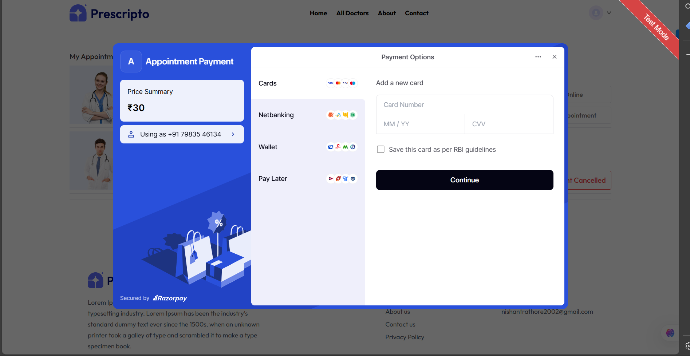
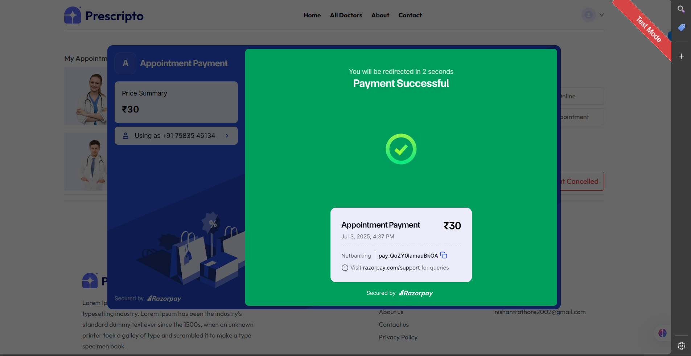
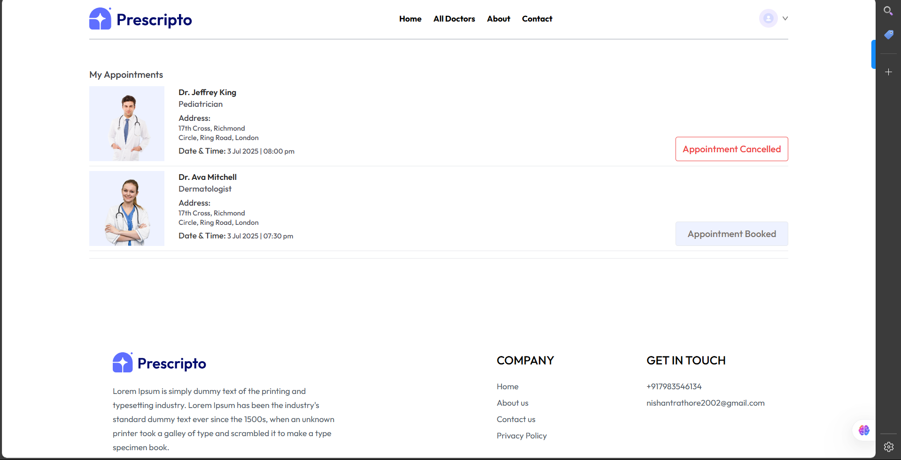
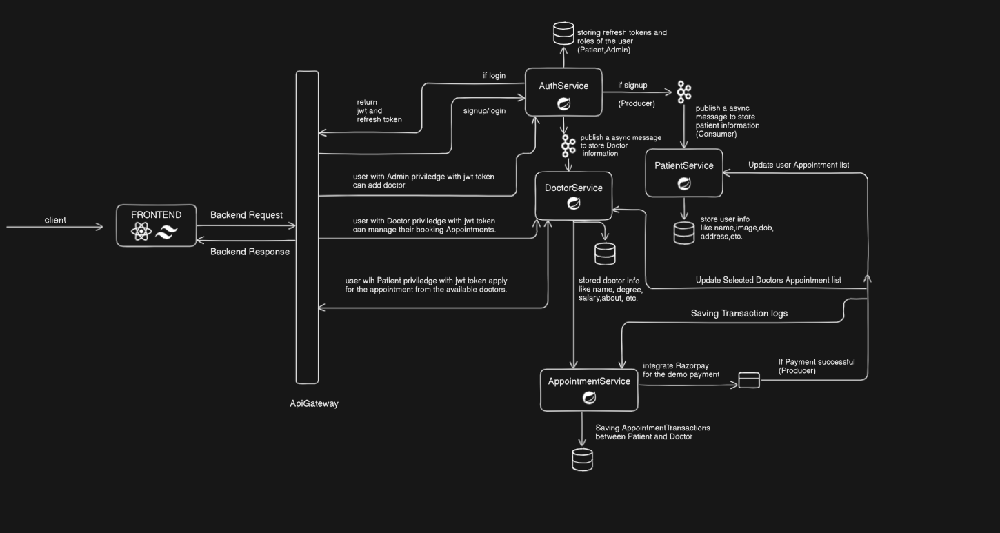

# Prescripto - Doctor Appointment Booking Platform

[](https://www.oracle.com/java/technologies/javase/jdk17-archive-downloads.html)
[](https://spring.io/projects/spring-boot)
[](https://reactjs.org/)
[](https://www.postgresql.org/)
[](https://kafka.apache.org/)
[](https://www.docker.com/)
[](https://aws.amazon.com/)

Prescripto is a modern, full-stack, cloud-native application designed to streamline the process of booking doctor appointments. Built on a robust microservices architecture, it provides a seamless and secure experience for patients, doctors, and administrators.

## 🚀 Live Demo & Credentials

The application is deployed and publicly accessible.

| Platform      | URL                                                                  | Status                                                                                                   |
|---------------|----------------------------------------------------------------------|----------------------------------------------------------------------------------------------------------|
| **Frontend App**  | [**https://prescripto-webapp.netlify.app**](https://doctor-appointment-project-topaz.vercel.app/) |  **Running** |
| **Admin Panel**   | [**https://prescripto-admin-teal.vercel.app**](https://prescripto-admin-teal.vercel.app) | **Running**                                                                                              |

You can explore the admin panel using the following demo credentials:

-   **Username:** `nishant@outlook.com`
-   **Password:** `nishantrathore`

> **Note:** These are demo-only credentials for review purposes.

---

## ✨ Key Features

-   **Role-Based Access Control:** Separate interfaces and privileges for Patients, Doctors, and Admins.
-   **Secure Authentication:** JWT-based authentication and authorization for secure API access.
-   **Microservices Architecture:** A scalable backend built with 5 independent services.
-   **Asynchronous Communication:** Uses Apache Kafka for event-driven actions like user profile creation, ensuring a responsive system.
-   **Doctor Discovery:** Patients can browse a comprehensive list of doctors and filter by specialty.
-   **Seamless Appointment Booking:** An intuitive multi-step process for booking and confirming appointments.
-   **Integrated Payment Gateway:** Secure payment processing powered by Razorpay in test mode.
-   **Appointment Management:** Patients can view their upcoming and past appointments and cancel if needed.
-   **Cloud-Native Deployment:** Fully containerized with Docker and deployed on AWS App Runner for high availability and scalability.

## 📸 Screenshots

| Landing Page                                        | Appointment Booking & Payment                               |
| --------------------------------------------------- | ----------------------------------------------------------- |
|          |                   |
| **Payment Successful**                              | **Appointment Management**                                  |
|  |              |

## 🛠️ Tech Stack & Architecture

Prescripto is built with a modern, decoupled tech stack designed for performance and scalability.

### System Architecture
The backend follows a microservices pattern, with an API Gateway as the single entry point. Services communicate synchronously via REST APIs and asynchronously via a Kafka message broker.



### Technologies Used

| Category      | Technology                                                                                                    |
|---------------|---------------------------------------------------------------------------------------------------------------|
| **Frontend**  | `React.js`, `Material-UI (MUI)`, `Axios`                                                                      |
| **Backend**   | `Java 21`, `Spring Boot 3`, `Spring Cloud Gateway`, `Spring Security`, `Spring Data JPA`, `Lombok`                |
| **Database**  | `PostgreSQL`                                                                                                  |
| **Messaging** | `Apache Kafka`                                                                                                |
| **DevOps**    | `Docker`, `Docker Compose`, `AWS ECR`, `AWS App Runner`, `Netlify` (Frontend), `Vercel` (Admin)                 |

## ⚙️ Local Setup and Installation

To run this project locally, you will need to have the following prerequisites installed:
-   Git
-   Java 17 or higher
-   Apache Maven
-   Node.js and npm
-   Docker and Docker Compose
-   An IDE like IntelliJ IDEA or VS Code

### Steps

1.  **Clone the repository:**
    ```bash
    git clone https://github.com/NISHANT-RATHORE/Doctor-Appointment-Project-2.0.git
    cd Doctor-Appointment-Project-2.0
    ```

2.  **Setup Backend Infrastructure:**
    The backend relies on PostgreSQL and Kafka. A `docker-compose.yml` file is provided in the `Backend` directory to easily spin up these services.
    ```bash
    cd Backend
    docker-compose up -d
    ```

3.  **Configure Environment Variables:**
    Each microservice in the `Backend` directory requires its own `application.properties` or `.env` file for database credentials, JWT secrets, and Kafka broker URLs. Refer to the respective configuration files for the required variables.

4.  **Run Backend Microservices:**
    You can run each of the 5 microservices (`ApiGateway`, `AuthService`, etc.) by:
    -   Opening each project in your IDE and running the main Spring Boot application class.
    -   Or by navigating to each service's directory and running: `mvn spring-boot:run`

5.  **Run Frontend Application:**
    ```bash
    cd ../Frontend
    npm install
    npm start
    ```
    The frontend will be available at `http://localhost:3000`.

6.  **Run Admin Panel:**
    Follow the same steps as the frontend for the admin panel project.

---

## ☁️ Cloud Deployment

The entire application is deployed using a modern, cloud-native strategy, leveraging serverless principles to ensure scalability and cost-efficiency.

### Deployment Architecture

| Component             | Service / Platform Used     | Purpose                                            |
|-----------------------|-----------------------------|----------------------------------------------------|
| **Backend Services**  | **AWS App Runner**          | Hosts the 5 containerized Spring Boot microservices. |
| **Container Registry**  | **AWS ECR**                 | Stores the Docker images for all backend services.   |
| **Database**          | **Neon** (Serverless Postgres) | Provides a fully managed, scalable SQL database.   |
| **Message Broker**    | **Confluent** (Serverless Kafka)| Manages asynchronous, event-driven communication.  |
| **Frontend App**      | **Netlify**                 | Deploys and hosts the main patient-facing web app. |
| **Admin Panel**       | **Vercel**                  | Deploys and hosts the admin web application.       |

### Deployment Workflow

The backend deployment is automated through a push-to-deploy workflow.

1.  **Prerequisites:**
    -   AWS CLI configured (`aws configure`)
    -   Docker installed and running

2.  **Infrastructure Setup:**
    -   A serverless PostgreSQL database is provisioned on **Neon**.
    -   A serverless Kafka cluster is provisioned on **Confluent**.
    -   The connection strings, API keys, and credentials from these services are used as environment variables in the App Runner configuration.

3.  **Backend Deployment to App Runner:**
    For each of the 5 backend microservices, the following process is followed:
    a. **Build the JAR:** The application is packaged using Maven:
       ```bash
       ./gradlew clean build -x test
       ```
    b. **Build Docker Image:** A container image is built using the service's `Dockerfile`.
       ```bash
       docker build -t <service-name> .
       ```
    c. **Push to ECR:** The image is tagged and pushed to its dedicated Amazon ECR repository.
       ```bash
       # Authenticate Docker with AWS ECR
       aws ecr get-login-password --region <your-region> | docker login --username AWS --password-stdin <your-aws-account-id>.dkr.ecr.<your-region>.amazonaws.com

       # Tag and Push
       docker tag <service-name>:latest <your-ecr-repo-uri>:latest
       docker push <your-ecr-repo-uri>:latest
       ```
    d. **Automatic Deployment:** AWS App Runner is configured to monitor the ECR repository. When a new image is pushed, App Runner automatically triggers a zero-downtime deployment, rolling out the new version.

4.  **Frontend Deployment:**
    -   The `Frontend` and `Admin` applications are connected to the GitHub repository. A `git push` to the `main` branch automatically triggers a new build and deployment on Netlify and Vercel, respectively.


## 🗺️ API Gateway Endpoints

The API Gateway is the single entry point for all backend requests.

| Method | Endpoint Prefix       | Forwards To         | Description                         |
|--------|-----------------------|---------------------|-------------------------------------|
| `ANY`  | `/api/auth/**`        | `AuthService`       | Handles user login, signup, and authentication. |
| `ANY`  | `/api/doctor/**`      | `DoctorService`     | Manages doctor profiles and listings.  |
| `ANY`  | `/api/patient/**`     | `PatientService`    | Manages patient-specific data.       |
| `ANY`  | `/api/appointment/**` | `AppointmentService`| Handles booking, payment, and cancellation. |

---

Developed with ❤️ by **Nishant Rathore**.
